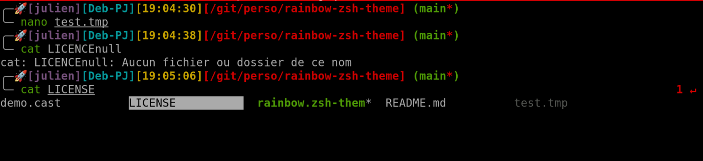

# 🌈 Rainbow Zsh Theme

A small, colorful Zsh theme for Oh My Zsh.

This README explains how to install Oh My Zsh (if you don't already have it) and how to add the `rainbow.zsh-theme` to your Oh My Zsh themes.



## ⚙️ Install Oh My Zsh

If you don't already have Oh My Zsh, install it using the recommended installer. You can use `curl` or `wget`:

Using curl:

```sh
sh -c "$(curl -fsSL https://raw.githubusercontent.com/ohmyzsh/ohmyzsh/master/tools/install.sh)"
```

Or using wget:

```sh
sh -c "$(wget -qO- https://raw.githubusercontent.com/ohmyzsh/ohmyzsh/master/tools/install.sh)"
```

These commands will back up your existing `~/.zshrc` and set up Oh My Zsh.

## 📁 Install the Rainbow Theme

There are two simple ways to install the theme from this repository.

1) Copy the theme file into the Oh My Zsh themes directory

```sh
# If you have this repository checked out locally, run (adjust path as needed):
cp /path/to/rainbow-zsh-theme/rainbow.zsh-theme ~/.oh-my-zsh/themes/

# Or from the project root (if you are inside the repo):
cp rainbow.zsh-theme ~/.oh-my-zsh/themes/
```

1) Install it into the Oh My Zsh custom themes directory (keeps it separate from core themes):

```sh
mkdir -p ~/.oh-my-zsh/custom/themes
cp rainbow.zsh-theme ~/.oh-my-zsh/custom/themes/
```

## 🔧 Configure Zsh to use the theme

Edit your `~/.zshrc` and set the theme name (without path or extension). For example, if the theme file is `rainbow.zsh-theme` and its theme name is `rainbow`, set:

```sh
ZSH_THEME="rainbow"
```

Then reload your shell configuration:

```sh
source ~/.zshrc
# or simply start a new terminal session
```

## 🔌 Recommended plugins

Oh My Zsh supports plugins. We recommend enabling `git` (bundled), plus two popular community plugins: `zsh-autosuggestions` and `zsh-syntax-highlighting`.

1) Install the plugins (if not already present):

```sh
# Git plugin is bundled with Oh My Zsh — no install needed.

# Install zsh-autosuggestions
git clone https://github.com/zsh-users/zsh-autosuggestions ~/.oh-my-zsh/custom/plugins/zsh-autosuggestions

# Install zsh-syntax-highlighting
git clone https://github.com/zsh-users/zsh-syntax-highlighting.git ~/.oh-my-zsh/custom/plugins/zsh-syntax-highlighting
```

2) Enable the plugins in `~/.zshrc` by adding them to the `plugins=(...)` list. Example:

```sh
plugins=(git zsh-autosuggestions zsh-syntax-highlighting)
```

Note: `zsh-syntax-highlighting` should be loaded last. If you source it manually, place its source line at the end of your `~/.zshrc` to ensure highlighting works correctly.

## ✅ Verify

Open a new terminal or run `echo $ZSH_THEME` to confirm the theme is applied. You should see the prompt style change to the rainbow theme's appearance.

## 🐛 Troubleshooting

- If the theme doesn't show up, ensure the theme file was copied to one of the following:
  - `~/.oh-my-zsh/themes/`
  - `~/.oh-my-zsh/custom/themes/`
- Check `~/.zshrc` for typos in `ZSH_THEME`.
- If you use a non-standard Oh My Zsh install location, adjust the copy path accordingly.

## 📜 License

This project inherits the repository license. See the `LICENSE` file for details.

Enjoy the colors! 🌈

